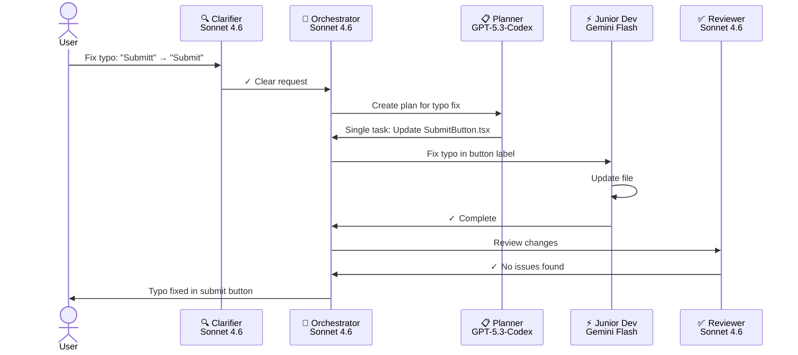
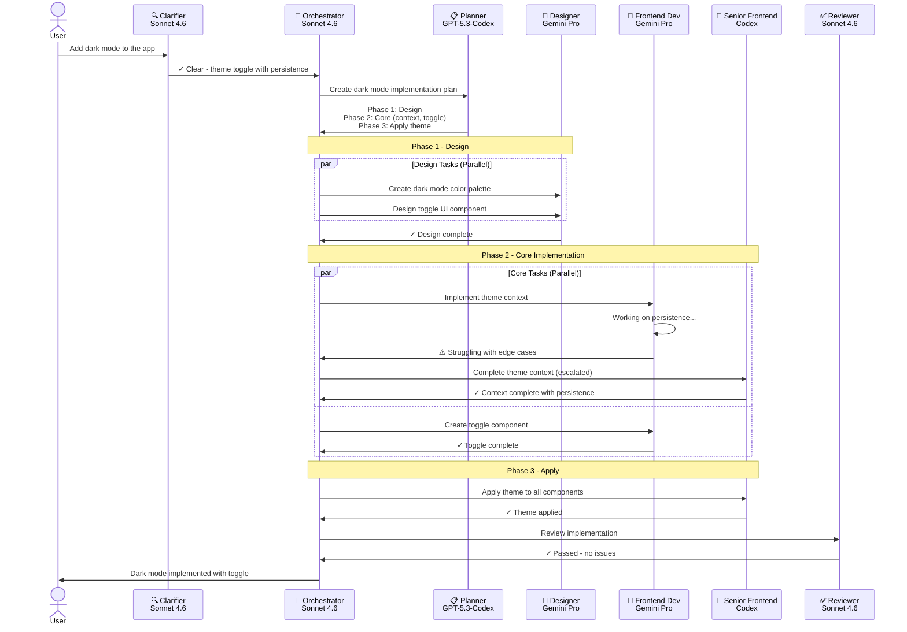
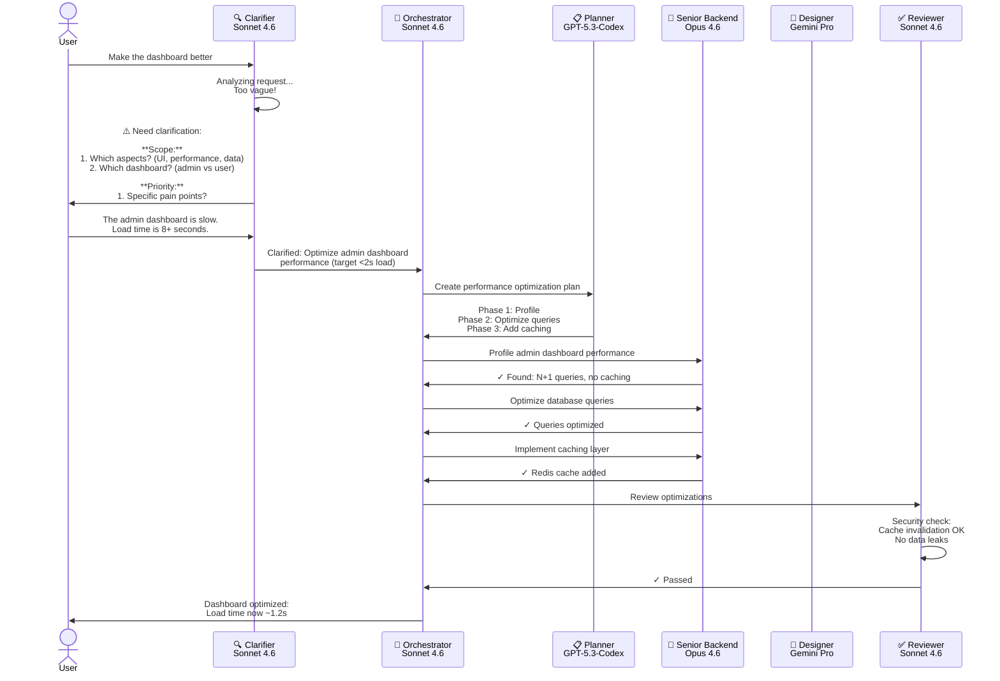
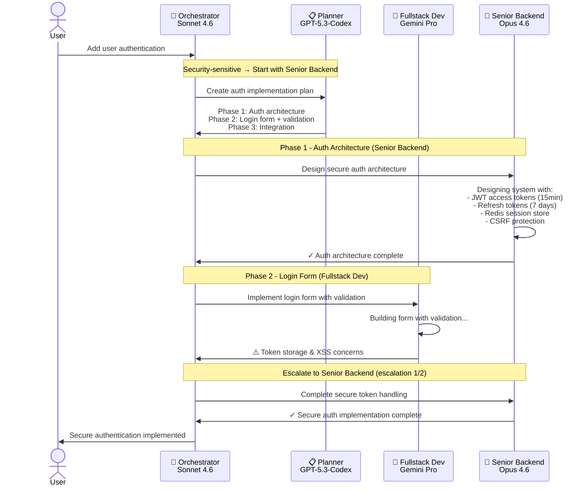

# Multi-Agent Development System

A production-grade orchestrated agent system that breaks down complex development tasks into specialized workflows with adaptive escalation, quality gates, and requirement clarification.

> 💡 **Tip:** Start with the **Orchestrator** agent - it will automatically delegate to the right specialists!

## Agent Architecture

```mermaid
graph TB
    User[👤 User Request]

    User --> Orchestrator

    subgraph "Coordination Layer"
        Orchestrator["🎯 Orchestrator<br/>Claude Sonnet 4.6<br/><i>Delegates & coordinates</i>"]
    end

    Orchestrator -->|Step 0| Clarifier
    Clarifier -.->|Returns requirements| Orchestrator

    subgraph "Clarification Layer"
        Clarifier["🔍 Clarifier<br/>Claude Sonnet 4.6<br/><i>Seeks clarification</i>"]
    end

    Orchestrator --> Planner

    subgraph "Planning Layer"
        Planner["📋 Planner<br/>GPT-5.3-Codex<br/><i>Creates strategies</i>"]
    end

    Orchestrator --> DevTeam
    Orchestrator --> Designer
    Orchestrator --> DataEng
    subgraph "Development Team - Adaptive Escalation"
        DevTeam["👨‍💻 Developer Agents"]
        Junior["⚡ Junior Developer<br/>Gemini 3 Flash<br/><i>Quick fixes, simple tasks</i>"]

        Frontend["🎨 Frontend Dev<br/>Gemini 3 Pro<br/><i>UI, components</i>"]
        Backend["⚙️ Backend Dev<br/>Claude Opus 4.6<br/><i>APIs, databases</i>"]
        Fullstack["🔄 Fullstack Dev<br/>Gemini 3 Pro<br/><i>End-to-end features</i>"]

        SrFrontend["🚀 Senior Frontend<br/>GPT-5.3-Codex<br/><i>Complex UI architecture</i>"]
        SrBackend["💎 Senior Backend<br/>Claude Opus 4.6<br/><i>Distributed systems</i>"]
        SrFullstack["🏆 Senior Fullstack<br/>GPT-5.3-Codex<br/><i>Complex integrations</i>"]

        DevTeam --> Junior
        DevTeam --> Frontend
        DevTeam --> Backend
        DevTeam --> Fullstack

        Frontend -.escalate.-> SrFrontend
        Backend -.escalate.-> SrBackend
        Fullstack -.escalate.-> SrFullstack
    end

    subgraph "Design Layer"
        Designer["🎨 Designer<br/>Gemini 3 Pro<br/><i>UI/UX design</i>"]
    end

    subgraph "Data Layer"
        DataEng["📊 Data Engineer<br/>Claude Opus 4.6<br/><i>SQL, ETL, analytics</i>"]
    end

    subgraph "Testing & Operations"
        Testing["🧪 Test Engineer<br/>Gemini 3 Pro<br/><i>Run/write tests</i>"]
        PromptWriter["✍️ Prompt Writer<br/>Gemini 3 Pro<br/><i>LLM prompt optimization</i>"]
        DevOps["⚙️ DevOps<br/>GPT-5.3-Codex<br/><i>Git, safeguards, deployment</i>"]
    end

    Orchestrator -->|Step 2.5| Testing
    Orchestrator -->|Step 2.5| DevOps
    Orchestrator --> PromptWriter
    Testing -.->|After review| Orchestrator
    DevOps -.->|After user approval| Orchestrator

    Orchestrator --> Reviewer

    subgraph "Quality Gate"
        Reviewer["✅ Reviewer<br/>Claude Sonnet 4.6<br/><i>Code review, security</i>"]
    end

    Reviewer --> Orchestrator

    style Clarifier fill:#e1f5ff,stroke:#01579b,stroke-width:2px
    style Orchestrator fill:#fff3e0,stroke:#e65100,stroke-width:3px
    style Planner fill:#f3e5f5,stroke:#4a148c,stroke-width:2px
    style Junior fill:#e8f5e9,stroke:#1b5e20,stroke-width:2px
    style Frontend fill:#e3f2fd,stroke:#0277bd,stroke-width:2px
    style Backend fill:#f3e5f5,stroke:#6a1b9a,stroke-width:2px
    style Fullstack fill:#fff3e0,stroke:#ef6c00,stroke-width:2px
    style SrFrontend fill:#bbdefb,stroke:#01579b,stroke-width:3px
    style SrBackend fill:#e1bee7,stroke:#4a148c,stroke-width:3px
    style SrFullstack fill:#ffe0b2,stroke:#e65100,stroke-width:3px
    style Designer fill:#fce4ec,stroke:#880e4f,stroke-width:2px
    style DataEng fill:#e0f2f1,stroke:#00695c,stroke-width:2px
    style Testing fill:#f3e5f5,stroke:#6a1b9a,stroke-width:2px
    style Reviewer fill:#fff9c4,stroke:#f57f17,stroke-width:2px
```



---

## Agent Roster

| Agent                                                          | Install                                                                                                                                                                                                                                                                                                                                                                                                                                                                                                                                                                                                                                                                                                | Model             | Primary Role               |
| -------------------------------------------------------------- | ------------------------------------------------------------------------------------------------------------------------------------------------------------------------------------------------------------------------------------------------------------------------------------------------------------------------------------------------------------------------------------------------------------------------------------------------------------------------------------------------------------------------------------------------------------------------------------------------------------------------------------------------------------------------------------------------------ | ----------------- | -------------------------- |
| **[🔍 Clarifier](clarifier.agent.md)**                         | [](https://aka.ms/awesome-copilot/install/agent?url=vscode%3Achat-agent/install%3Furl%3Dhttps%3A//raw.githubusercontent.com/simkeyur/vscode-agents/main/.github/agents/clarifier.agent.md)<br/>[](https://aka.ms/awesome-copilot/install/agent?url=vscode-insiders%3Achat-agent/install%3Furl%3Dhttps%3A//raw.githubusercontent.com/simkeyur/vscode-agents/main/.github/agents/clarifier.agent.md)               | Claude Sonnet 4.6 | Requirements Analysis      |
| **[🎯 Orchestrator](orchestrator.agent.md)**                   | [](https://aka.ms/awesome-copilot/install/agent?url=vscode%3Achat-agent/install%3Furl%3Dhttps%3A//raw.githubusercontent.com/simkeyur/vscode-agents/main/.github/agents/orchestrator.agent.md)<br/>[](https://aka.ms/awesome-copilot/install/agent?url=vscode-insiders%3Achat-agent/install%3Furl%3Dhttps%3A//raw.githubusercontent.com/simkeyur/vscode-agents/main/.github/agents/orchestrator.agent.md)         | Claude Sonnet 4.6 | Coordination               |
| **[📋 Planner](planner.agent.md)**                             | [](https://aka.ms/awesome-copilot/install/agent?url=vscode%3Achat-agent/install%3Furl%3Dhttps%3A//raw.githubusercontent.com/simkeyur/vscode-agents/main/.github/agents/planner.agent.md)<br/>[](https://aka.ms/awesome-copilot/install/agent?url=vscode-insiders%3Achat-agent/install%3Furl%3Dhttps%3A//raw.githubusercontent.com/simkeyur/vscode-agents/main/.github/agents/planner.agent.md)                   | GPT-5.3-Codex     | Strategy                   |
| **[⚡ Junior Developer](junior-dev.agent.md)**                 | [](https://aka.ms/awesome-copilot/install/agent?url=vscode%3Achat-agent/install%3Furl%3Dhttps%3A//raw.githubusercontent.com/simkeyur/vscode-agents/main/.github/agents/junior-dev.agent.md)<br/>[](https://aka.ms/awesome-copilot/install/agent?url=vscode-insiders%3Achat-agent/install%3Furl%3Dhttps%3A//raw.githubusercontent.com/simkeyur/vscode-agents/main/.github/agents/junior-dev.agent.md)             | Gemini 3 Flash    | Quick Fixes                |
| **[🎨 Frontend Developer](frontend-dev.agent.md)**             | [](https://aka.ms/awesome-copilot/install/agent?url=vscode%3Achat-agent/install%3Furl%3Dhttps%3A//raw.githubusercontent.com/simkeyur/vscode-agents/main/.github/agents/frontend-dev.agent.md)<br/>[](https://aka.ms/awesome-copilot/install/agent?url=vscode-insiders%3Achat-agent/install%3Furl%3Dhttps%3A//raw.githubusercontent.com/simkeyur/vscode-agents/main/.github/agents/frontend-dev.agent.md)         | Gemini 3 Pro      | Component Implementation   |
| **[⚙️ Backend Developer](backend-dev.agent.md)**               | [](https://aka.ms/awesome-copilot/install/agent?url=vscode%3Achat-agent/install%3Furl%3Dhttps%3A//raw.githubusercontent.com/simkeyur/vscode-agents/main/.github/agents/backend-dev.agent.md)<br/>[](https://aka.ms/awesome-copilot/install/agent?url=vscode-insiders%3Achat-agent/install%3Furl%3Dhttps%3A//raw.githubusercontent.com/simkeyur/vscode-agents/main/.github/agents/backend-dev.agent.md)           | Claude Opus 4.6   | API Logic & CRUD           |
| **[🔄 Fullstack Developer](fullstack-dev.agent.md)**           | [](https://aka.ms/awesome-copilot/install/agent?url=vscode%3Achat-agent/install%3Furl%3Dhttps%3A//raw.githubusercontent.com/simkeyur/vscode-agents/main/.github/agents/fullstack-dev.agent.md)<br/>[](https://aka.ms/awesome-copilot/install/agent?url=vscode-insiders%3Achat-agent/install%3Furl%3Dhttps%3A//raw.githubusercontent.com/simkeyur/vscode-agents/main/.github/agents/fullstack-dev.agent.md)       | Gemini 3 Pro      | End-to-End Features        |
| **[🚀 Senior Frontend Developer](sr-frontend-dev.agent.md)**   | [](https://aka.ms/awesome-copilot/install/agent?url=vscode%3Achat-agent/install%3Furl%3Dhttps%3A//raw.githubusercontent.com/simkeyur/vscode-agents/main/.github/agents/sr-frontend-dev.agent.md)<br/>[](https://aka.ms/awesome-copilot/install/agent?url=vscode-insiders%3Achat-agent/install%3Furl%3Dhttps%3A//raw.githubusercontent.com/simkeyur/vscode-agents/main/.github/agents/sr-frontend-dev.agent.md)   | GPT-5.3-Codex     | Complex UI Architecture    |
| **[💎 Senior Backend Developer](sr-backend-dev.agent.md)**     | [](https://aka.ms/awesome-copilot/install/agent?url=vscode%3Achat-agent/install%3Furl%3Dhttps%3A//raw.githubusercontent.com/simkeyur/vscode-agents/main/.github/agents/sr-backend-dev.agent.md)<br/>[](https://aka.ms/awesome-copilot/install/agent?url=vscode-insiders%3Achat-agent/install%3Furl%3Dhttps%3A//raw.githubusercontent.com/simkeyur/vscode-agents/main/.github/agents/sr-backend-dev.agent.md)     | Claude Opus 4.6   | Distributed Systems        |
| **[🏆 Senior Fullstack Developer](sr-fullstack-dev.agent.md)** | [](https://aka.ms/awesome-copilot/install/agent?url=vscode%3Achat-agent/install%3Furl%3Dhttps%3A//raw.githubusercontent.com/simkeyur/vscode-agents/main/.github/agents/sr-fullstack-dev.agent.md)<br/>[](https://aka.ms/awesome-copilot/install/agent?url=vscode-insiders%3Achat-agent/install%3Furl%3Dhttps%3A//raw.githubusercontent.com/simkeyur/vscode-agents/main/.github/agents/sr-fullstack-dev.agent.md) | GPT-5.3-Codex     | Complex Integrations       |
| **[📊 Data Engineer](data-engineer.agent.md)**                 | [](https://aka.ms/awesome-copilot/install/agent?url=vscode%3Achat-agent/install%3Furl%3Dhttps%3A//raw.githubusercontent.com/simkeyur/vscode-agents/main/.github/agents/data-engineer.agent.md)<br/>[](https://aka.ms/awesome-copilot/install/agent?url=vscode-insiders%3Achat-agent/install%3Furl%3Dhttps%3A//raw.githubusercontent.com/simkeyur/vscode-agents/main/.github/agents/data-engineer.agent.md)       | Claude Opus 4.6   | Analytics & Data Pipelines |
| **[🎨 Designer](designer.agent.md)**                           | [](https://aka.ms/awesome-copilot/install/agent?url=vscode%3Achat-agent/install%3Furl%3Dhttps%3A//raw.githubusercontent.com/simkeyur/vscode-agents/main/.github/agents/designer.agent.md)<br/>[](https://aka.ms/awesome-copilot/install/agent?url=vscode-insiders%3Achat-agent/install%3Furl%3Dhttps%3A//raw.githubusercontent.com/simkeyur/vscode-agents/main/.github/agents/designer.agent.md)                 | Gemini 3 Pro      | Visual Design & Mockups    |
| **[✍️ Prompt Writer](prompt-writer.agent.md)**                 | [](https://aka.ms/awesome-copilot/install/agent?url=vscode%3Achat-agent/install%3Furl%3Dhttps%3A//raw.githubusercontent.com/simkeyur/vscode-agents/main/.github/agents/prompt-writer.agent.md)<br/>[](https://aka.ms/awesome-copilot/install/agent?url=vscode-insiders%3Achat-agent/install%3Furl%3Dhttps%3A//raw.githubusercontent.com/simkeyur/vscode-agents/main/.github/agents/prompt-writer.agent.md)       | Gemini 3 Pro      | Prompt Engineering         |
| **[🧪 Test Engineer](test-engineer.agent.md)**                 | [](https://aka.ms/awesome-copilot/install/agent?url=vscode%3Achat-agent/install%3Furl%3Dhttps%3A//raw.githubusercontent.com/simkeyur/vscode-agents/main/.github/agents/test-engineer.agent.md)<br/>[](https://aka.ms/awesome-copilot/install/agent?url=vscode-insiders%3Achat-agent/install%3Furl%3Dhttps%3A//raw.githubusercontent.com/simkeyur/vscode-agents/main/.github/agents/test-engineer.agent.md)       | Gemini 3 Pro      | Testing                    |
| **[⚙️ DevOps](devops.agent.md)**                               | [](https://aka.ms/awesome-copilot/install/agent?url=vscode%3Achat-agent/install%3Furl%3Dhttps%3A//raw.githubusercontent.com/simkeyur/vscode-agents/main/.github/agents/devops.agent.md)<br/>[](https://aka.ms/awesome-copilot/install/agent?url=vscode-insiders%3Achat-agent/install%3Furl%3Dhttps%3A//raw.githubusercontent.com/simkeyur/vscode-agents/main/.github/agents/devops.agent.md)                     | GPT-5.3-Codex     | Operations & Safeguards    |
| **[✅ Reviewer](reviewer.agent.md)**                           | [](https://aka.ms/awesome-copilot/install/agent?url=vscode%3Achat-agent/install%3Furl%3Dhttps%3A//raw.githubusercontent.com/simkeyur/vscode-agents/main/.github/agents/reviewer.agent.md)<br/>[](https://aka.ms/awesome-copilot/install/agent?url=vscode-insiders%3Achat-agent/install%3Furl%3Dhttps%3A//raw.githubusercontent.com/simkeyur/vscode-agents/main/.github/agents/reviewer.agent.md)                 | Claude Sonnet 4.6 | Quality Assurance          |

---

## Workflow Scenarios

### Scenario 1: Simple Task (Typo Fix)



### Scenario 2: Complex Feature (Dark Mode)



### Scenario 3: Ambiguous Request (Needs Clarification)



### Scenario 4: Adaptive Escalation



---

## Key Features

### 🎯 Adaptive Escalation

- Start with lightest agent (cost-effective)
- Escalate when complexity exceeds capacity
- **Self-Escalation Protocol**: Agents stop and notify Orchestrator when encountering security-sensitive code, architectural decisions, error loops, or hidden complexity

### ⚡ Intelligent Parallelization

- File-based conflict detection
- Independent tasks run simultaneously
- Sequential execution only when needed

### 🔍 Requirement Clarification

- Clarifier agent intercepts ambiguous requests
- Silent project context detection (tests, Git repository)
- Targeted questions with context
- Reasonable defaults when appropriate
- Structured `Clarification Result` output with scope and project context

### 🛡️ Smart Safeguards

#### Project Context Awareness

- **Automatic Detection**: Clarifier detects project capabilities (HAS_TESTS, HAS_GIT) without user prompts
- **User Preferences**: Orchestrator remembers testing and Git safeguard preferences across sessions

#### Testing Safeguards

- **Conditional Prompting**: Offers testing only for projects with tests, for significant changes (>2 files)
- **Flexible Options**: Run existing tests, write new tests, or both
- **Test Engineer Agent**: Dedicated agent for running/writing tests with clear output format

#### Git Safeguards

- **Risk-Based**: Prompts only for significant changes (5+ files, core systems, architectural changes)
- **User-Controlled**: Create safety commit, work on new branch, or proceed without backup
- **DevOps Orchestration**: Git operations are opt-in and explicitly delegated

#### Post-Completion Learning

- Store user preferences (testing/git choices)
- Record reusable patterns for similar tasks
- Track escalation paths to identify complex areas

### ✅ Quality Gates

- Reviewer agent checks all work
- Security, bugs, performance validation
- Max 2 retry cycles before escalation
- No code reaches user without review
- Test Engineer runs/writes tests after review (if requested)

### 📊 Cost Optimization

- **Gemini Flash** for simple tasks (fastest, cheapest)
- **Gemini Pro** for standard work (balanced)
- **GPT-5.3-Codex** for speed-critical features
- **Claude Opus** only for critical/complex work

---

## Agent Boundaries

Clear separation of responsibilities to prevent overlap:

### 📊 Data Engineer vs ⚙️ Backend Developer

**Data Engineer** (Data-Centric Work)

- ✅ Analytical SQL queries (aggregations, window functions, complex JOINs)
- ✅ Data warehousing & ETL pipelines (Databricks, Spark, Airflow)
- ✅ Batch data processing & transformations
- ✅ Data quality validation & cleansing
- ✅ Working with data files (CSV, JSON, Parquet)
- ✅ Analytics, reporting queries, data modeling
- ❌ CRUD APIs or real-time request handling
- ❌ Application business logic
- ❌ User authentication/authorization

**Backend Developer** (Application Logic)

- ✅ REST/GraphQL API development
- ✅ Business rules & workflows
- ✅ CRUD operations for applications
- ✅ Authentication, authorization, sessions
- ✅ Real-time request/response handling
- ✅ Microservices & application integration
- ❌ Complex analytical queries or data warehousing
- ❌ Large-scale ETL pipelines
- ❌ Databricks/Spark jobs

**Rule of Thumb:** If it powers an API endpoint → Backend Developer. If it processes/analyzes bulk data → Data Engineer.

### 🎨 Designer vs 🎨 Frontend Developer

**Designer** (Visual Design & Planning)

- ✅ Creating mockups, prototypes, wireframes
- ✅ Defining color palettes, typography, spacing systems
- ✅ Design tokens & style guides
- ✅ User experience flows & interaction patterns
- ✅ Brand guidelines & visual identity
- ❌ Writing production code (React, Vue, etc.)
- ❌ Implementing components with logic
- ❌ API integration or state management

**Frontend Developer** (Implementation)

- ✅ Implementing designs as functional components
- ✅ Writing HTML/CSS/JavaScript/TypeScript
- ✅ Component logic, state management, routing
- ✅ API integration & data fetching
- ✅ Form handling, validation, interactivity
- ❌ Creating design systems from scratch
- ❌ Making major design decisions (without Designer input)
- ❌ Visual mockups or prototypes

**Rule of Thumb:** Designer creates the blueprint → Frontend Developer builds it. Designer hands off Figma/specs → Developer writes code.

### Quick Reference: Which Agent for Common Tasks?

| Task                                                | Correct Agent               | NOT This Agent              |
| --------------------------------------------------- | --------------------------- | --------------------------- |
| "Build a REST API for user management"              | ⚙️ Backend Developer        | ❌ Data Engineer            |
| "Write SQL query to analyze last quarter's revenue" | 📊 Data Engineer            | ❌ Backend Developer        |
| "Create Databricks notebook for ETL pipeline"       | 📊 Data Engineer            | ❌ Backend Developer        |
| "Design the color scheme and layout for dashboard"  | 🎨 Designer                 | ❌ Frontend Developer       |
| "Implement the login form with validation"          | 🎨 Frontend Developer       | ❌ Designer                 |
| "Build a React component from this Figma file"      | 🎨 Frontend Developer       | ❌ Designer                 |
| "Create mockup showing user flow for checkout"      | 🎨 Designer                 | ❌ Frontend Developer       |
| "Optimize this slow Spark job processing logs"      | 📊 Data Engineer            | ❌ Senior Backend Developer |
| "Create microservice architecture for payments"     | 💎 Senior Backend Developer | ❌ Data Engineer            |

---

## Decision Matrix

### When Starting a Task

| Task Complexity                     | Files | Lines    | Start With                              |
| ----------------------------------- | ----- | -------- | --------------------------------------- |
| Typo fix, config change             | 1-2   | <50      | ⚡ Junior Developer                     |
| Standard feature                    | 3-5   | 50-300   | 🎨 Frontend/Backend/Fullstack Developer |
| Multi-file feature, API integration | 5+    | 300-1000 | 🚀 Senior Frontend/Backend/Fullstack    |
| Architecture, security, performance | Any   | Any      | 💎 Senior Backend Developer             |

### When to Escalate

| Sign                                     | Action                                         |
| ---------------------------------------- | ---------------------------------------------- |
| Multiple clarification rounds            | Escalate one level                             |
| Security/performance concerns            | Escalate to Senior Backend/Fullstack Developer |
| Agent indicates scope exceeds capability | Escalate one level                             |

---

## Getting Started

1. **User makes request** → Goes to Orchestrator first
2. **Orchestrator** → Calls Clarifier (Step 0) to confirm or clarify requirements
3. **Clarifier** → Returns confirmed/clarified requirements to Orchestrator
4. **Orchestrator** → Calls Planner for strategy
5. **Planner** → Returns phased implementation plan
6. **Orchestrator** → Delegates to specialists, monitors progress
7. **Specialists** → Execute tasks (with escalation as needed)
8. **Reviewer** → Validates quality before user delivery
9. **Orchestrator** → Reports results to user

---

## Best Practices

✅ **DO:**

- Let Clarifier handle ambiguous requests
- Start with lightest appropriate agent
- Run independent tasks in parallel
- Review before finalizing
- Document assumptions when clarifying

❌ **DON'T:**

- Skip clarification for vague requests
- Over-assign (use Senior devs for simple tasks)
- Run file-overlapping tasks in parallel
- Skip review step
- Let specialists create their own documentation

---

## Model Selection Rationale

| Model                 | Use Case                                       | Strengths                                |
| --------------------- | ---------------------------------------------- | ---------------------------------------- |
| **Claude Sonnet 4.6** | Orchestration, Review, Clarification           | Reasoning, coordination, analysis        |
| **Claude Opus 4.6**   | Backend development, Data engineering          | Deep technical expertise, careful design |
| **GPT-5.3-Codex**     | Planning                                       | Strategic thinking, comprehensive plans  |
| **GPT-5.3-Codex**     | Senior Frontend/Fullstack, DevOps              | Speed, code generation, tooling          |
| **Gemini 3 Pro**      | Frontend/Fullstack dev, Design, Prompt writing | Balanced performance, good at UI         |
| **Gemini 3 Flash**    | Junior developer tasks                         | Fastest execution, cost-effective        |

---

## Agent Files

- [`orchestrator.agent.md`](orchestrator.agent.md) - Main coordination logic with safeguard assessment (Step 2.5)
- [`clarifier.agent.md`](clarifier.agent.md) - Requirement clarification + silent project context detection
- [`planner.agent.md`](planner.agent.md) - Strategy creation with risk estimation and dependency graphs
- [`junior-dev.agent.md`](junior-dev.agent.md) - Quick fixes and simple tasks with escalation protocol
- [`frontend-dev.agent.md`](frontend-dev.agent.md) - UI and components with escalation protocol
- [`backend-dev.agent.md`](backend-dev.agent.md) - APIs and databases with escalation protocol
- [`fullstack-dev.agent.md`](fullstack-dev.agent.md) - End-to-end features with escalation protocol
- [`sr-frontend-dev.agent.md`](sr-frontend-dev.agent.md) - Complex UI architecture with escalation protocol
- [`sr-backend-dev.agent.md`](sr-backend-dev.agent.md) - Distributed systems with escalation protocol
- [`sr-fullstack-dev.agent.md`](sr-fullstack-dev.agent.md) - Complex integrations with escalation protocol
- [`test-engineer.agent.md`](test-engineer.agent.md) - Run/write tests, invoked by Orchestrator after review
- [`data-engineer.agent.md`](data-engineer.agent.md) - SQL, ETL, and analytics
- [`designer.agent.md`](designer.agent.md) - UI/UX design
- [`prompt-writer.agent.md`](prompt-writer.agent.md) - Prompt engineering
- [`devops.agent.md`](devops.agent.md) - Operations, deployment, and Git safeguards
- [`reviewer.agent.md`](reviewer.agent.md) - Quality assurance with retry limits

---

## Orchestrator Execution Flow

**Complete workflow with safeguards and learning:**

```
User Request
  ↓
Step 0: Clarifier (Project Context Detection)
  ├── Silent scan for HAS_TESTS, HAS_GIT
  └── Return structured Clarification Result
  ↓
Step 1: Planner (Estimation + Dependencies)
  ├── Risk assessment
  ├── Dependency graph
  └── Return phased plan
  ↓
Step 2.5: Safeguard Assessment
  ├── IF HAS_TESTS + significant change → Prompt for testing
  ├── IF HAS_GIT + significant change → Prompt for Git safeguard
  ├── Retrieve user preferences from memory
  └── Execute DevOps safeguards if user chose Git backup
  ↓
Steps 3-4: Implementation & Review (max 2 retry cycles)
  ├── Specialists execute with escalation protocol
  ├── Reviewer validates quality
  └── Remediate blockers if found
  ↓
Step 4: Test Engineer (if testing was accepted)
  ├── Run existing tests OR write new tests OR both
  └── Report results
  ↓
Step 6: Post-Completion Learning
  ├── Store user preferences
  ├── Record reusable patterns
  └── Note escalation paths
  ↓
User (verbal summary, no docs)
```

---

## Self-Escalation Protocol

All developer agents (Junior through Senior) have a built-in escalation protocol. When encountering the following, agents respond with `ESCALATION_NEEDED: [reason]` so the Orchestrator can reassign:

- **Security Audits**: Auth flows, encryption, credentials handling
- **Architectural Scope**: Decisions beyond component/service level
- **Error Loops**: Repeated failed attempts with no resolution
- **Hidden Complexity**: Distributed systems, cross-service contracts, or performance-critical paths

This prevents agents from struggling in silence and ensures tasks are escalated to appropriate expertise early.

---

**System Rating: 10/10** ⭐⭐⭐⭐⭐⭐⭐⭐⭐⭐

A production-grade multi-agent development system with intelligent orchestration, adaptive resource allocation, smart safeguards with memory, comprehensive quality gates, and one-click installation.

---

## Skills & Specialized Knowledge

Agents have access to specialized skills for domain-specific guidance:

### Development Skills

- **TypeScript Patterns** - Advanced types, generics, type-safe APIs, React & Node.js patterns
- **Code Quality & Clean Code** - SOLID principles, design patterns, refactoring, code smells
- **Data Transformation & ETL** - CSV/JSON/XML parsing, validation, streaming/batch processing

### Platform & Architecture

- **Frontend Architecture** - Performance optimization, component design, state management
- **API Design** - RESTful patterns, versioning, error handling
- **Database Optimization** - Query optimization, indexing, performance tuning

### Quality & Security

- **Testing & QA** - Unit, integration, E2E testing strategies
- **Security Best Practices** - Authentication, encryption, vulnerability prevention

---

## Cost Optimization

The adaptive escalation model optimizes costs by matching agent capability to task complexity:

- **70% of tasks** → Junior Developer (Gemini Flash) - Quick fixes and simple implementations
- **20% of tasks** → Frontend/Backend/Fullstack Developers - Standard features and APIs
- **10% of tasks** → Senior Frontend/Backend/Fullstack Developers (Opus/Codex) - Complex architecture and critical systems

**Key Benefits:**

- Start with the most cost-effective agent appropriate for the task
- Escalate only when complexity demands it
- Parallel execution reduces overall time and token usage
- Mandatory clarification prevents costly rework
- Quality gates catch issues before production

This approach delivers enterprise-grade quality while keeping costs predictable and efficient. 🚀
